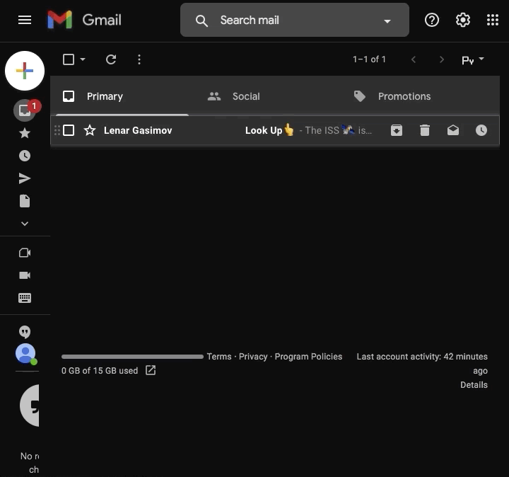

# Day 33: API Endpoints and API Parameters - ISS Overhead Notifier

## Exercise

- None

## ISS Overhead Notifier:

- Note:
  - This App needs an env file to work
    1. create .env 
    2. change the import path in the main.py referring to your .env file
    3. install env plugin in your machine
    4. your env file should have the following:
       1. gmail_user = 'youremail' 
       2. gmail_password = 'yourpassword' 
       3. provider = 'your email provider{for gmail:  smtp.gmail.com  }'
    5. read the following articles for help:
       1. How to get a Google App Password: https://www.youtube.com/watch?v=J4CtP1MBtOE
       2. How to Send Emails with Gmail using Python: https://stackabuse.com/how-to-send-emails-with-gmail-using-python
       3. SMTP protocol client¶: https://docs.python.org/3/library/smtplib.html
       4. How to send an email with Gmail as provider using Python: https://stackoverflow.com/questions/10147455/how-to-send-an-email-with-gmail-as-provider-using-python/27515833#27515833
    6. if nothing work, pls update your python version. 
    7. google let you connect only with App password.{follow th youtube tutorial}

-