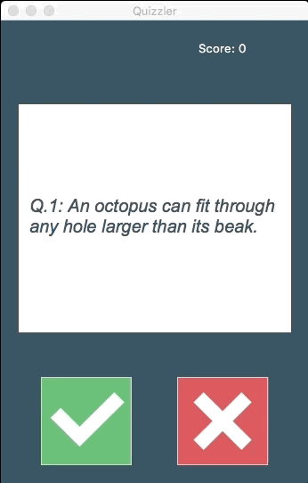

# Day 34 Learnt about HTML unescaping & created UI using Tkinter and built a Quizzler Program using API from open Trivia Database that helps review API endpoints and parameters.

## Exercise
- None

## Quizzler

