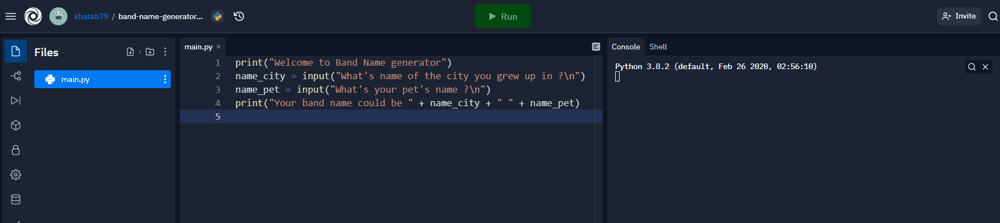

# Day 1 - Working with Variables in Python to Manage Data

## Exercise

- https://replit.com/@khatab79/day-1-2-exercise?v=1
- https://replit.com/@khatab79/day-1-3-exercise?v=1
- https://replit.com/@khatab79/day-1-variables-start?v=1
- https://replit.com/@khatab79/day-1-4-exercise?v=1

## Band Name Generator

https://replit.com/@khatab79/band-name-generator-start#main.py